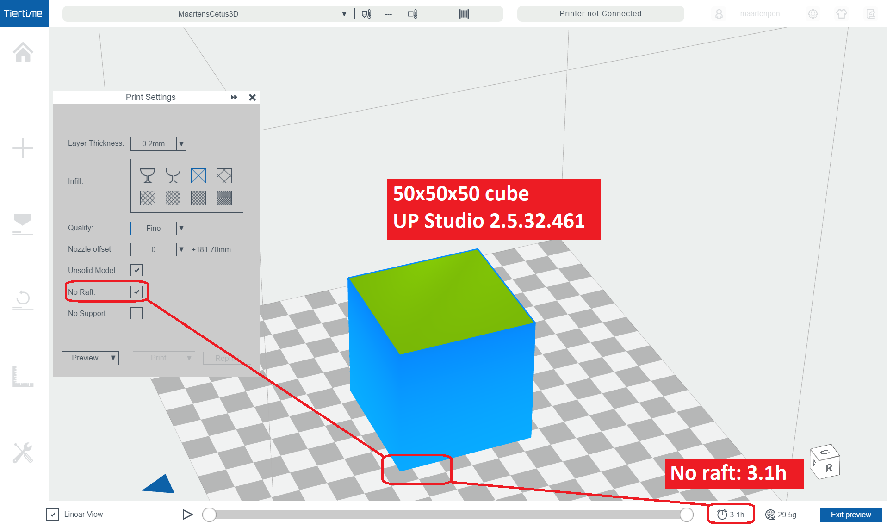
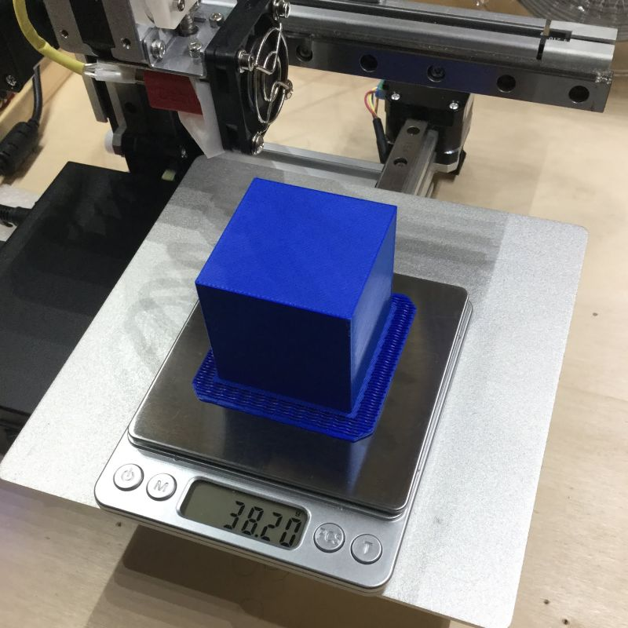
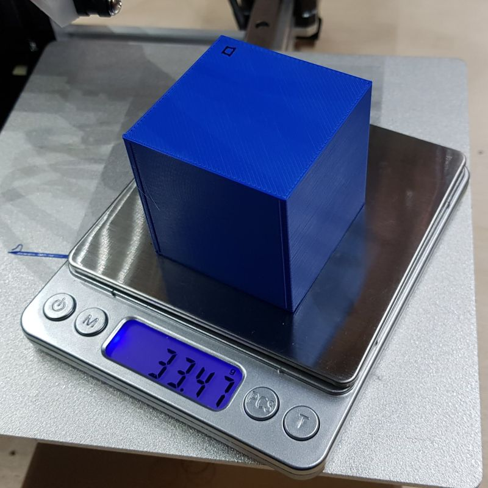

# Analysis

Checking the forecasts of my Cetus3D.


## Introduction

I was wondering how accurate the forecasts of my Cetus3D are; I'm using UP Studio 2.5.32.461.
I designed a [50x50x50 mm3 cube](cube50x50x50.stl), and printed that with PLA filament.

I tried several combinations of print settings, and wrote down the forecast of time and mass.
Here are two examples





## Results

These are my findings.

First, I varied in Infill and Quality (printing With Raft)

|  Layer  | Infill  | Quality | Unsolid | No Raft |  Time   | Mass (g)|    |
|:-------:|:-------:|:-------:|:-------:|:-------:|:-------:|:-------:|:---:
|   0.2   |no bottop|  fast   |   [v]   |   [ ]   | 40.0min |    8.9  |    |
|   0.2   |   no    |  fast   |   [v]   |   [ ]   |   1.0h  |   20.2  |    |
|   0.2   |   13%   |  fast   |   [v]   |   [ ]   |   1.7h  |   34.3  |    |
|   0.2   |   65%   |  fast   |   [v]   |   [ ]   |   2.5h  |   56.9  |    |
|   0.2   |   99%   |  fast   |   [v]   |   [ ]   |   6.4h  |  158.5  |    |
|         |         |         |         |         |         |         |    |
|   0.2   |no bottop| normal  |   [v]   |   [ ]   | 50.9min |    8.8  |    |
|   0.2   |   no    | normal  |   [v]   |   [ ]   |   1.4h  |   20.1  |    |
|   0.2   |   13%   | normal  |   [v]   |   [ ]   |   2.2h  |   34.2  |    |
|   0.2   |   65%   | normal  |   [v]   |   [ ]   |   3.3h  |   56.8  |    |
|   0.2   |   99%   | normal  |   [v]   |   [ ]   |   8.2h  |  158.4  |    |
|         |         |         |         |         |         |         |    |
|   0.2   |no bottop|  fine   |   [v]   |   [ ]   |   1.2h  |    8.8  |    |
|   0.2   |   no    |  fine   |   [v]   |   [ ]   |   1.9h  |   20.1  |    |
|   0.2   |   13%   |  fine   |   [v]   |   [ ]   |   2.8h  |   34.2  |  * |
|   0.2   |   65%   |  fine   |   [v]   |   [ ]   |   4.2h  |   56.9  |    |
|   0.2   |   99%   |  fine   |   [v]   |   [ ]   |  10.3h  |  158.5  |    |

Next, same, but now without raft

|  Layer  | Infill  | Quality | Unsolid | No Raft |  Time   | Mass (g)|    |
|:-------:|:-------:|:-------:|:-------:|:-------:|:-------:|:-------:|:---|
|   0.2   |no bottop|  fast   |   [v]   |   [v]   | 20.8min |    6.3  |    |
|   0.2   |   no    |  fast   |   [v]   |   [v]   |   1.2h  |   15.4  |    |
|   0.2   |   13%   |  fast   |   [v]   |   [v]   |   1.8h  |   29.4  |    |
|   0.2   |   65%   |  fast   |   [v]   |   [v]   |   2.7h  |   52.1  |    |
|   0.2   |   99%   |  fast   |   [v]   |   [v]   |   6.5h  |  153.7  |    |
|         |         |         |         |         |         |         |    |
|   0.2   |no bottop| normal  |   [v]   |   [v]   | 26.8min |    6.3  |    |
|   0.2   |   no    | normal  |   [v]   |   [v]   |   1.6h  |   15.5  |    |
|   0.2   |   13%   | normal  |   [v]   |   [v]   |   2.4h  |   29.5  |    |
|   0.2   |   65%   | normal  |   [v]   |   [v]   |   3.5h  |   52.1  |    |
|   0.2   |   99%   | normal  |   [v]   |   [v]   |   8.4h  |  153.7  |    |
|         |         |         |         |         |         |         |    |
|   0.2   |no bottop|  fine   |   [v]   |   [v]   | 42.2min |    6.3  |    |
|   0.2   |   no    |  fine   |   [v]   |   [v]   |   2.2h  |   15.4  |    |
|   0.2   |   13%   |  fine   |   [v]   |   [v]   |   3.1h  |   29.5  |  * |
|   0.2   |   65%   |  fine   |   [v]   |   [v]   |   4.4h  |   52.2  |    |
|   0.2   |   99%   |  fine   |   [v]   |   [v]   |  10.5h  |  153.8  |    |

Note: the cases with * are actually printed.


# Looking at Mass

## Forecast

We see that Quality does not influence Mass. 
For example 13% Infill (and with Raft) uses 34.3, 34.2 and 34.2 for Fast, Normal respectively Fine.
For example 13% Infill (and No Raft) uses 29.4, 29.5 and 29.5 for Fast, Normal respectively Fine.

I expected this: the print head moves faster, but deposits the same amount of material 
(the PLA flow through the nozzles grows with the same factor as the nozzle movement).

Of course, adding a raft does add mass.
If we pairwise compare the masses With and Without Raft, we get this table.

| Infill  | Quality | Mass (g)| Mass (g)| Diff (g)| Note |
|:-------:|:-------:|:-------:|:-------:|:-------:|:----:|
|no bottop|  fast   |    8.9  |    6.3  |   2.6   |  (1) |
|   no    |  fast   |   20.2  |   15.4  |   4.8   |      |
|   13%   |  fast   |   34.3  |   29.4  |   4.9   |      |
|   65%   |  fast   |   56.9  |   52.1  |   4.8   |      |
|   99%   |  fast   |  158.5  |  153.7  |   4.8   |      |
|         |         |         |         |         |      |
|no bottop| normal  |    8.8  |    6.3  |   2.5   |  (1) |
|   no    | normal  |   20.1  |   15.5  |   5.6   |  (2) |
|   13%   | normal  |   34.2  |   29.5  |   4.7   |      |
|   65%   | normal  |   56.8  |   52.1  |   4.7   |      |
|   99%   | normal  |  158.4  |  153.7  |   4.7   |      |
|         |         |         |         |         |      |
|no bottop|  fine   |    8.8  |    6.3  |   2.5   |  (1) |
|   no    |  fine   |   20.1  |   15.4  |   4.7   |      |
|   13%   |  fine   |   34.2  |   29.5  |   4.7   |   *  |
|   65%   |  fine   |   56.9  |   52.2  |   4.7   |      |
|   99%   |  fine   |  158.5  |  153.8  |   4.7   |      |

The conclusion would be that for this cube, a raft has a mass of 4.7 grams.

Note (1): The case of Infill set to No Bot/Top, is probably special: there is no bottom in the cube, so the raft can be simpler.

Note (2): I can not explain this outlier of 5.6 grams.

Note *  : The cases that were  printed.


## Actual

The cases labeled (3) have been printed.

Let's first look at With Raft:



Next at No Raft:



|   Case    | Forecast (g) |  Actual (g)  | Error |
|:---------:|:------------:|:------------:|:-----:|
| With Raft |     34.2     |     38.20    |   12% |
|  No Raft  |     29.5     |     33.47    |   13% |

This sample is small (two cases) but they show a mass underestimation by UP Studio: 
the actual PLA usage is 12% higher. That is a fairly big error.


# Looking at Time

The first question that interests me is how much slower is it when going from Fast to Normal to Fine.

Second question is what a raft does with printing time.


## Quality and time

Find below the forecast of the print times, for Qualities Fast, Normal and Fine, when printing With Raft, using different Infills.
The "ratio" columns show the increase in time when changing the Quality.

| Infill |  Fast | Ratio  | Normal | Ratio  |  Fine  |
|:------:|:-----:|:------:|:------:|:------:|:------:|
|   13%  |  1.70 |  1.29  |  2.20  | 1.27   |  2.80  |
|   65%  |  2.50 |  1.32  |  3.30  | 1.27   |  4.20  |
|   99%  |  6.40 |  1.28  |  8.20  | 1.26   | 10.30  |

The same table, but now Without Raft

| Infill |  Fast | Ratio  | Normal | Ratio  |  Fine  |
|:------:|:-----:|:------:|:------:|:------:|:------:|
|   13%  |  1.80 |  1.33  |  2.40  |  1.29  |  3.10  |
|   65%  |  2.70 |  1.30  |  3.50  |  1.26  |  4.40  |
|   99%  |  6.50 |  1.29  |  8.40  |  1.25  | 10.50  |

We see that print time roughly increases with 30% when moving from Fast to Normal, 
or from Normal to Fine (factor is in the range 1.25 .. 1.33).


## Raft and time

Of course, adding a raft does change printing time.
But we are in for a surprise: adding a raft decreases time.
If we pairwise compare the masses With and Without Raft, we get this table.

|  Infill   | Quality |  Time  |  Time  |  Ratio | Note |
|:---------:|:-------:|:------:|:------:|:------:|:----:|
| no bottop |  fast   |  0.67  |  0.35  |  0.52  |      |
|    no     |  fast   |  1.00  |  1.20  |  1.20  |      |
| 13%       |  fast   |  1.70  |  1.80  |  1.06  |      |
| 65%       |  fast   |  2.50  |  2.70  |  1.08  |      |
| 99%       |  fast   |  6.40  |  6.50  |  1.02  |      |
|           |         |        |        |        |      | 
| no bottop | normal  |  0.85  |  0.45  |  0.53  |      |
|    no     | normal  |  1.40  |  1.60  |  1.14  |      |
| 13%       | normal  |  2.20  |  2.40  |  1.09  |      |
| 65%       | normal  |  3.30  |  3.50  |  1.06  |      |
| 99%       | normal  |  8.20  |  8.40  |  1.02  |      |
|           |         |        |        |        |      | 
| no bottop |  fine   |  1.20  |  0.70  |  0.59  |      |
|    no     |  fine   |  1.90  |  2.20  |  1.16  |      |
| 13%       |  fine   |  2.80  |  3.10  |  1.11  |   *  |
| 65%       |  fine   |  4.20  |  4.40  |  1.05  |      |
| 99%       |  fine   | 10.30  | 10.50  |  1.02  |      |

As we can see (excluding the No Bottom/Top Infill), printing Without Raft is 2 to 20% slower!
But is this true?
The two prints in row labeled * were actually logged, see the next section.


## Log of the actual printing process

The actual logs are in the repo: [With Raft](withraft.log) and [No Raft](noraft.png).


This is the (start and end of the) log of the print With Raft.
```
"2019-02-18 20:48:19" stat: 00006 00087s : 0202/printing        L0000   0.0mm   0%  2:49:13 199.74C  17.32C 
"2019-02-18 20:48:30" stat: 00007 00097s : 0202/printing        L0000   0.0mm   0%  2:49:13 213.04C  17.32C 
"2019-02-18 20:48:40" stat: 00008 00107s : 0202/printing        L0001   0.0mm   0%  2:49:13   1.00x   0.34x 
"2019-02-18 20:48:50" stat: 00009 00118s : 0202/printing        L0001   0.0mm   0%  2:49:13   1.00x   0.34x 
...
"2019-02-18 23:26:21" stat: 00921 09572s : 0202/printing        L0257  49.8mm  98%  0:02:19   1.00x   0.34x 
"2019-02-18 23:26:31" stat: 00922 09582s : 0202/printing        L0257  49.8mm  98%  0:02:19   1.00x   0.34x 
"2019-02-18 23:26:42" stat: 00923 09593s : 0103/ready           L0000   0.0mm   0%  0:00:00 209.90C  17.32C 
"2019-02-18 23:26:52" stat: 00924 09603s : 0103/ready           L0000   0.0mm   0%  0:00:00 197.20C  17.32C 
```

This is the (start and end of the) log of the print No Raft.
```
"2019-02-19 19:29:29" stat: 00007 00074s : 0202/printing        L0000   0.0mm   0%  3:05:24 195.50C  17.32C 
"2019-02-19 19:29:40" stat: 00008 00085s : 0202/printing        L0000   0.0mm   0%  3:05:24 207.36C  17.32C 
"2019-02-19 19:29:50" stat: 00009 00095s : 0202/printing        L0000   0.0mm   0%  3:05:24   0.98x   0.34x 
"2019-02-19 19:30:01" stat: 00010 00105s : 0202/printing        L0001   0.2mm   0%  3:05:24   1.00x   0.34x 
...
"2019-02-19 22:04:55" stat: 00910 09400s : 0202/printing        L0249  49.8mm  98%  0:02:19   0.98x   0.34x 
"2019-02-19 22:05:05" stat: 00911 09410s : 0202/printing        L0249  49.8mm  98%  0:02:19   1.00x   0.34x 
"2019-02-19 22:05:16" stat: 00912 09420s : 0103/ready           L0000   0.0mm   0%  0:00:00 210.54C  17.32C 
"2019-02-19 22:05:26" stat: 00913 09431s : 0103/ready           L0000   0.0mm   0%  0:00:00 201.98C  17.32C 
```

We can confirm that the forecast for With Raft is 2:49:13 or 2.81 hour.

Likewise, the forecast for No Raft is 3:05:24 or 3.08 hour.

If we look at the actual runtime for With Raft, we see that it ran from 20:48:40 to 23:26:42, this is a total of 2:38:02 or 2.63 hour.

Likewise, the actual runtime for No Raft from 19:29:50 to 22:05:16, this is a total of 2:35:26 or 2.58 hour.


| Case      | UP Studio (h) | Cetus3D (h) |  Actual (h) | UP/Actual |
|:---------:|:-------------:|:-----------:|:-----------:|:---------:|
| With Raft |        2.80   |       2.81  |      2.63   |   1.065   |
| No Raft   |        3.10   |       3.08  |      2.58   |   1.202   |

So, the reports from Cetus3D are close to the forecast of UP Studio; that is good.

We now see that printing without raft is faster, as expected, not slower as predicted by UP Studio or Cetus3D.

The print time With Raft is over estimated 6.5%.

The print time No Raft is over estimated 20.2%.


# Conclusions

The conclusion for PLA usage are 
 - the extra amount of PLA for the raft is consistently reported
 - actual PLA usage is 12% higher than the forecast amount
 
The conclusions for print time are
 - print time roughly increases with 30% when moving from Fast to Normal, or from Normal to Fine
 - printing without raft is slightly faster (2%), not slower (10%) as predicted by UP Studio or Cetus3D
 - print time With Raft is over estimated 6.5%
 - print time No Raft is over estimated 20.2%

(end)

