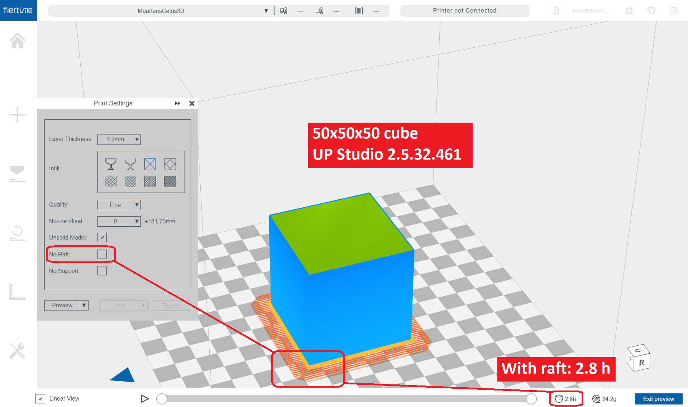

# Analysis

Checking the forecasts of my Cetus3D.

## Introduction

I was wondering how accurate the forecasts of my Cetus3D are.
I designed a [50x50x50 mm3 cube](cube50x50x50.stl).
I previewed prints on UP Studio 2.5.32.461.
I used PLA as filament.

## Results

These are my findings.

First, I varied in Infill and Quality

|  Layer  | Infill  | Quality | Unsolid | No Raft |  Time   | Mass (g)|
|:-------:|:-------:|:-------:|:-------:|:-------:|:-------:|:-------:|
|   0.2   |no bottop|  fast   |   [v]   |   [ ]   | 40.0min |    8.9  |
|   0.2   |   no    |  fast   |   [v]   |   [ ]   |   1.0h  |   20.2  |
|   0.2   |   13%   |  fast   |   [v]   |   [ ]   |   1.7h  |   34.3  |
|   0.2   |   65%   |  fast   |   [v]   |   [ ]   |   2.5h  |   56.9  |
|   0.2   |   99%   |  fast   |   [v]   |   [ ]   |   6.4h  |  158.5  |
|         |         |         |         |         |         |         |
|   0.2   |no bottop| normal  |   [v]   |   [ ]   | 50.9min |    8.8  |
|   0.2   |   no    | normal  |   [v]   |   [ ]   |   1.4h  |   20.1  |
|   0.2   |   13%   | normal  |   [v]   |   [ ]   |   2.2h  |   34.2  |
|   0.2   |   65%   | normal  |   [v]   |   [ ]   |   3.3h  |   56.8  |
|   0.2   |   99%   | normal  |   [v]   |   [ ]   |   8.2h  |  158.4  |
|         |         |         |         |         |         |         |
|   0.2   |no bottop|  fine   |   [v]   |   [ ]   |   1.2h  |    8.8  |
|   0.2   |   no    |  fine   |   [v]   |   [ ]   |   1.9h  |   20.1  |
|   0.2   |   13%   |  fine   |   [v]   |   [ ]   |   2.8h  |   34.2  |
|   0.2   |   65%   |  fine   |   [v]   |   [ ]   |   4.2h  |   56.9  |
|   0.2   |   99%   |  fine   |   [v]   |   [ ]   |  10.3h  |  158.5  |

Next, same, but now without raft

|  Layer  | Infill  | Quality | Unsolid | No Raft |  Time   | Mass (g)|
|:-------:|:-------:|:-------:|:-------:|:-------:|:-------:|:-------:|
|   0.2   |no bottop|  fast   |   [v]   |   [v]   | 20.8min |    6.3  |
|   0.2   |   no    |  fast   |   [v]   |   [v]   |   1.2h  |   15.4  |
|   0.2   |   13%   |  fast   |   [v]   |   [v]   |   1.8h  |   29.4  |
|   0.2   |   65%   |  fast   |   [v]   |   [v]   |   2.7h  |   52.1  |
|   0.2   |   99%   |  fast   |   [v]   |   [v]   |   6.5h  |  153.7  |
|         |         |         |         |         |         |         |
|   0.2   |no bottop| normal  |   [v]   |   [v]   | 26.8min |    6.3  |
|   0.2   |   no    | normal  |   [v]   |   [v]   |   1.6h  |   15.5  |
|   0.2   |   13%   | normal  |   [v]   |   [v]   |   2.4h  |   29.5  |
|   0.2   |   65%   | normal  |   [v]   |   [v]   |   3.5h  |   52.1  |
|   0.2   |   99%   | normal  |   [v]   |   [v]   |   8.4h  |  153.7  |
|         |         |         |         |         |         |         |
|   0.2   |no bottop|  fine   |   [v]   |   [v]   | 42.2min |    6.3  |
|   0.2   |   no    |  fine   |   [v]   |   [v]   |   2.2h  |   15.4  |
|   0.2   |   13%   |  fine   |   [v]   |   [v]   |   3.1h  |   29.5  |
|   0.2   |   65%   |  fine   |   [v]   |   [v]   |   4.4h  |   52.2  |
|   0.2   |   99%   |  fine   |   [v]   |   [v]   |  10.5h  |  153.8  |

# Looking as Mass

## Forecast

We see that Quality does not influence Mass. 
For example 13% Infill (and with Raft) uses 34.3, 34.2 and 34.2 for fast, normal respectively fine.
For example 13% Infill (and No Raft) uses 29.4, 29.5 and 29.5 for fast, normal respectively fine.

I expected this: the print head moves faster, but deposits the same amount of material 
(the PLA flow through the nozzles increases with the same factot as the nozzle movement).

If we pairwise compare the masses with and without raft, we get this table.

| Infill  | Quality | Mass (g)| Mass (g)| Diff (g)| Note |
|:-------:|:-------:|:-------:|:-------:|:-------:|:----:|
|no bottop|  fast   |    8.9  |    6.3  |   2.6   |  (1) |
|   no    |  fast   |   20.2  |   15.4  |   4.8   |      |
|   13%   |  fast   |   34.3  |   29.4  |   4.9   |      |
|   65%   |  fast   |   56.9  |   52.1  |   4.8   |      |
|   99%   |  fast   |  158.5  |  153.7  |   4.8   |      |
|         |         |         |         |         |      |
|no bottop| normal  |    8.8  |    6.3  |   2.5   |  (1) |
|   no    | normal  |   20.1  |   15.5  |   5.6   |  (2) |
|   13%   | normal  |   34.2  |   29.5  |   4.7   |      |
|   65%   | normal  |   56.8  |   52.1  |   4.7   |      |
|   99%   | normal  |  158.4  |  153.7  |   4.7   |      |
|         |         |         |         |         |      |
|no bottop|  fine   |    8.8  |    6.3  |   2.5   |  (1) |
|   no    |  fine   |   20.1  |   15.4  |   4.7   |      |
|   13%   |  fine   |   34.2  |   29.5  |   4.7   |  (3) |
|   65%   |  fine   |   56.9  |   52.2  |   4.7   |      |
|   99%   |  fine   |  158.5  |  153.8  |   4.7   |      |

The conclusion would be that for this cube, a raft has a mass of 4.7 grams.

Note (1): The case of Infill set ot No Bot/Top, is probably special: there is no bottom in the cube, so the raft can be simpler.
Note (2): I can not explain this outlier of 5.6 grams.
Note (3): These two I actually printed, see below.

## Printed

The cases labeled (3) have been printed.

Let's first look at With Raft:

Next at Without Raft:

